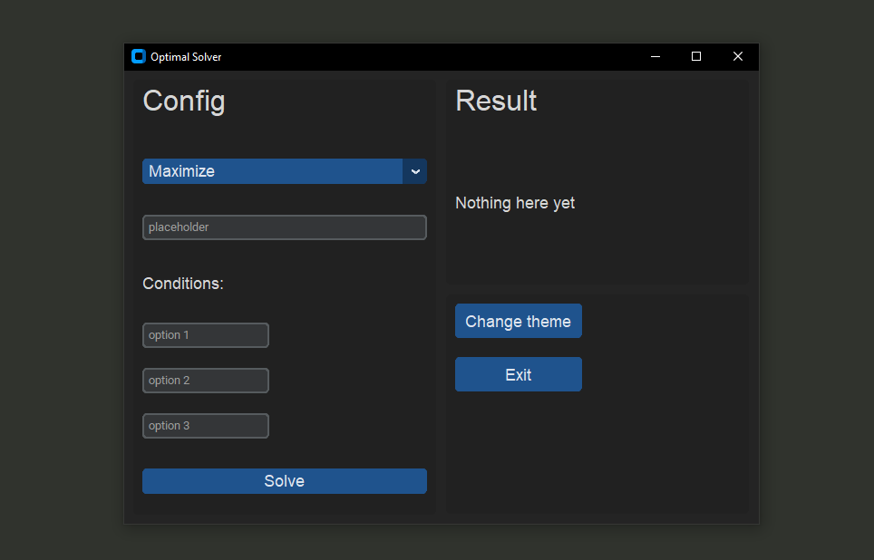

# Optimization solver - W.I.P!!!
Simple graphic calculator for optimization problems with report generator.



### Features
- Genetic algorythm-based solver
- Import/export reports (short PDFs)
- Minimalistic GUI
- Theme selector

### Requirements: 
- Python 3.10
- Manim library
- customTKinter library

### Getting Started

1. Clone this repository
   ```bash
   git clone https://github.com/Macck209/optimization-solver
2. Run the script
    ```bash
    python optimization-solver.py